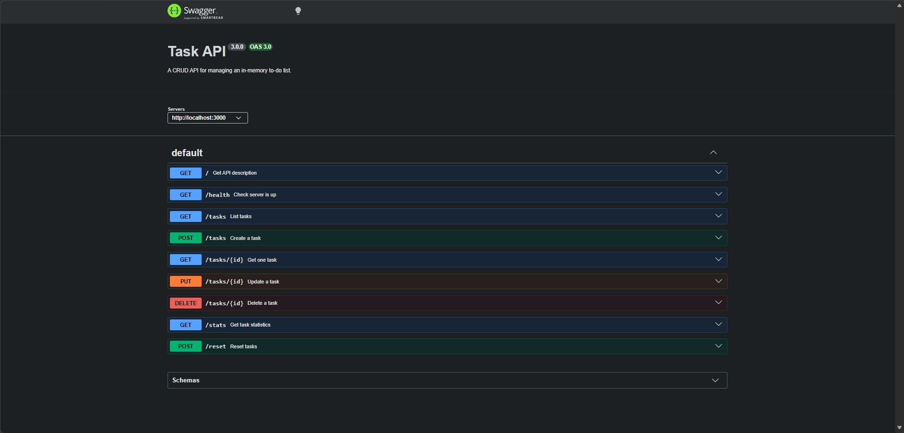

# Task API

A small CRUD API for managing an in-memory to-do list, built with Node.js and Express as part of the FlyRank Backend Internship (Week 2, Assignment A1).

Supports full Create, Read, Update, and Delete on tasks, interactive documentation via Swagger UI, and a couple of stretch extras (filtering, search, stats, reset).

#### 🚀 Built as part of the FlyRank Backend Internship (Week 2, Assignment A1).

## Tech stack

- **Node.js** + **Express** — server and routing
- **swagger-ui-express** — interactive API docs, served from a hand-written OpenAPI 3.0 spec (`openai.json`)
- **In-memory storage** — tasks live in a JavaScript array; data resets on server restart (no database yet)

## Prerequisites

You need **Node.js 18 or later** (npm comes bundled with it). Check if you already have it:

```bash
node --version
npm --version
```

If either command fails, install Node from [nodejs.org](https://nodejs.org) (choose the LTS version) — the installer includes npm automatically. No database, API keys, or environment variables are needed for this project.

## Install & run

```bash
# 1. Clone the repo and enter the folder
git clone https://github.com/davidyassa/CRUD_API.git
cd CRUD_API

# 2. Install dependencies (reads package.json + package-lock.json,
#    installs exact locked versions into node_modules/)
npm install

# 3. Start the server
node server.js
```

You should see:

```
Server running on http://localhost:3000
```

The server is now running on **http://localhost:3000**. Interactive docs are available at **http://localhost:3000/docs**.

> Leave this terminal running. Open a **second** terminal to send requests (curl examples below) or use the Swagger UI in your browser.

## Endpoints

| Method | Path         | Description                                                                    |
| ------ | ------------ | ------------------------------------------------------------------------------ |
| GET    | `/`          | API description                                                                |
| GET    | `/health`    | Liveness check                                                                 |
| GET    | `/tasks`     | List all tasks — supports `?done=true\|false` and `?search=term` query filters |
| GET    | `/tasks/:id` | Get a single task by id                                                        |
| POST   | `/tasks`     | Create a task (`{ "title": "..." }` in body)                                   |
| PUT    | `/tasks/:id` | Update a task's `title` and/or `done`                                          |
| DELETE | `/tasks/:id` | Delete a task                                                                  |
| GET    | `/stats`     | Total and completed task counts                                                |
| POST   | `/reset`     | Clears tasks and restores the 3 seed tasks                                     |

### Status codes

| Code | Meaning                                                     |
| ---- | ----------------------------------------------------------- |
| 200  | Successful read/update                                      |
| 201  | Task created                                                |
| 204  | Task deleted (empty body)                                   |
| 400  | Invalid or missing input (e.g. empty title, malformed JSON) |
| 404  | Task with that id doesn't exist                             |
| 409  | A task with that title already exists                       |

## Example request

```
$ curl -i -X POST http://localhost:3000/tasks -H "Content-Type: application/json" -d "{\"title\":\"Buy milk\"}"

HTTP/1.1 201 Created
X-Powered-By: Express
Content-Type: application/json; charset=utf-8
Content-Length: 40

{"id":4,"title":"Buy milk","done":false}
```

## Swagger UI

Full interactive documentation, including request/response schemas and a "Try it out" panel for every endpoint, is available at `/docs` once the server is running.



*(Screenshot: paste your `/docs` capture into a `docs/` folder in the repo and update the path above, or drag the image directly into this README on GitHub.)*

## Extras built beyond the core spec

- **Query filtering** — `GET /tasks?done=true` and `GET /tasks?search=milk` (combinable)
- **`GET /stats`** — total and completed task counts
- **`POST /reset`** — restores the three seed tasks, useful for demos
- **Duplicate-title check (409)** on `POST /tasks`

## Known limitations

- Data is in-memory only — **restarting the server clears all tasks** and reseeds the 3 example tasks. This is intentional for this stage of the assignment (see [Done means](#) in the assignment brief) — persistence arrives with a database in a later week.
- No authentication — this is a local development API, not production-hardened.
- Port `3000` is hardcoded rather than read from an environment variable.


## Project structure

```
.
├── server.js          # Express app — all routes and logic
├── openai.json         # OpenAPI 3.0 spec powering Swagger UI at /docs
├── package.json
└── README.md
```

